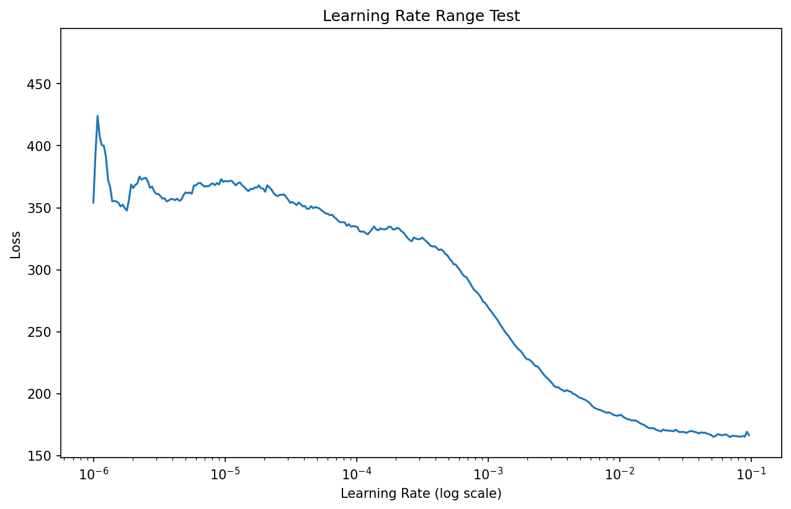
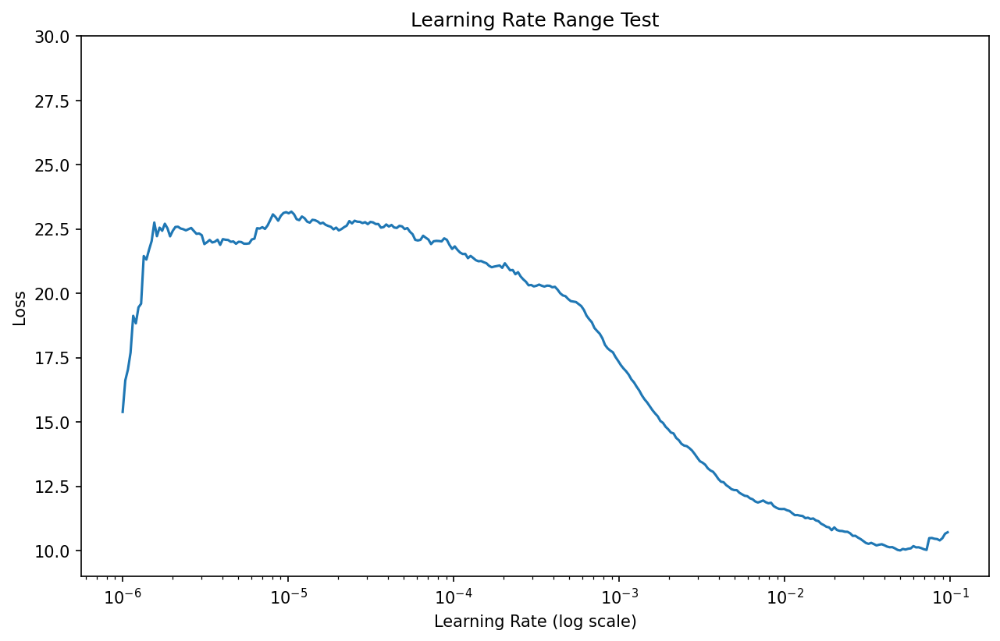

# YOLOv1 From Scratch


## 从零手写 YOLOv1 —— 不依赖任何检测框架，逐行理解目标检测的底层逻辑

---

## 项目介绍

本项目是对经典目标检测算法 **YOLOv1**（You Only Look Once v1, Redmon et al., 2016）的完整从零复现，使用 **PyTorch** 实现，不借助任何目标检测框架（如 Detectron2、MMDetection 等）。

与直接调用高层 API 的学习方式不同，本项目的每一行代码均独立编写，涵盖数据加载、模型搭建、损失函数设计、训练流程、评估指标、推理可视化，直至视频目标追踪的完整开发链路。这是我深入理解计算机视觉**目标检测全栈开发流程**的核心实践项目，也是我 CV 方向研究学习的重要组成部分。

> 「手写」不是目的，理解是目的。手写是理解最有效的路径。

---

## 项目背景

本项目是我 CV 方向学习路径的第一个核心实践项目，位于"**目标级视觉 2D 感知**"阶段。

选择 YOLOv1 而非直接上手 YOLOv5 或 YOLO 系列最新版，原因有三：

1. **YOLOv1 是 anchor-free 单阶段检测器的思想起点**——后续的 YOLO 版本虽然引入了 anchor box、特征金字塔、解耦头等大量工程优化，但核心的"把目标检测转化为端到端回归问题"这一设计决策在 v1 中就已完成。理解 v1，是理解后续一切改进的前提。
2. **从零复现能完整经历每一个设计决策**——为什么要分 7×7 的网格？为什么每个网格要预测 2 个 box？Loss 里 `λ_coord = 5` 和 `λ_noobj = 0.5` 的权衡从何而来？这些问题在调用高层 API 时是看不见的，但手搓每一行代码时会自然浮现。
3. **24 层网络是理解深度学习工程化的最小完整体**——足够小（单卡可训），足够大（涵盖数据加载、模型搭建、损失设计、训练循环、推理后处理的全链路），是一个极佳的学习载体。

---

## 项目目标与学习收获

通过本项目，我系统掌握了以下能力：

- **理解 YOLOv1 的核心思想**：网格单元（Grid Cell）划分、边界框（Bounding Box）回归、多任务联合损失函数的设计哲学；
- **掌握 Pascal VOC 数据集的完整处理流程**：XML 标注解析、类别映射、数据增强策略；
- **从头构建深度神经网络**：理解 YOLOv1 的 24 层卷积 + 2 层全连接层架构，以及每层的感受野与特征语义；
- **深入理解目标检测 Loss 的各个分项**：坐标损失、置信度损失、分类损失的数学推导与代码实现；
- **构建完整的深度学习工程训练链路**：从数据准备到模型保存、从推理到可视化的工程闭环；
- **初探多目标追踪（MOT）**：在帧级检测结果的基础上实现目标 ID 关联与轨迹跟踪。

---

## 当前进度 (Phase)

| Phase | 模块 | 状态 | 说明 |
| :---: | :--- | :---: | :--- |
| 1 | 📁 项目结构搭建 | ✅ 完成 | 目录规范、模块划分、代码风格统一 |
| 1 | 📦 Pascal VOC2007 数据准备 | ✅ 完成 | 数据集下载、目录组织、路径配置 |
| 1 | 📦 Pascal VOC2012 数据准备 | ✅ 完成 | 引入 VOC2012 与 VOC2007 联合训练，数据量提升 3.3 倍 |
| 2 | 🗂️ `VOCDataset` 数据加载器 | ✅ 完成 | XML 解析、类别映射、transform 接口 |
| 2 | 🧪 数据加载单元测试 | ✅ 完成 | 独立测试文件，验证 Bounding Box 与标签正确性 |
| 3 | 🏗️ YOLOv1 模型结构 | ✅ 完成 | 24 层卷积 + 2 层全连接检测头架构完整搭建 |
| 4 | 📉 前向传播与 Loss 函数 | ✅ 完成 | `forward` 输出严格对齐 `(batch_size, 1470)`；Loss 完整实现（坐标/置信度/分类三分项 + IoU 工具）并已通过 Sanity Test |
| 5 | 🔁 训练循环 + 可视化 | ✅ 完成 | `train.py` + `utils/lr_finder.py` + LR Finder 自动调优 |
| 6 | 🔍 推理与 NMS + mAP 评估 | ✅ 完成 | ✅ `utils/nms.py` + ✅ `detect.py`（纯函数库） + ✅ `utils/map.py` |
| 6 | 🖼️ 推理入口脚本 | ✅ 完成 | `run_detect.py`：单图/目录/验证集采样三种模式，加载 `best_model.pth` 直接出检测结果图 |
| 7 | 📊 画图可视化模块 | ✅ 完成 | `utils/plot_utils.py`：双 y 轴训练曲线 + 单指标曲线绘制 |
| 8 | 🎥 视频目标追踪 (SORT) | ⏳ 待开始 | `track.py`，基于 SORT 或简单 IoU 匹配 |

---

## 核心技术理解

### 网络架构设计哲学

YOLOv1 的检测网络由 **24 层卷积特征提取主干** 和 **2 层全连接检测头** 组成。Conv1-2（7×7 conv → maxpool → 3×3 conv → maxpool）做初始特征提取与快速降采样；Conv3-16 借鉴 GoogLeNet 的 bottleneck 思想，通过 **1×1 卷积降维 + 3×3 卷积扩展通道数** 的交替堆叠，在 112×112 到 7×7 的各级特征尺度上逐步加深通道（128→1024）；Conv23-24 在 7×7 分辨率下做最终的特征整合。全连接部分先将 7×7×1024 展平后投影到 4096 维，再直接回归到 1470 维的检测输出。

### 核心超参数配置

本项目严格遵循 YOLOv1 原始论文的配置：网格数 **S=7**，每个网格预测边界框数 **B=2**，Pascal VOC 类别数 **C=20**。输出特征图形状严格对齐为 `(batch_size, 1470)`，符合数学契约 `7 × 7 × (2 × 5 + 20) = 1470`。模型总参数量为 **271,703,550**，其中约 75% 的参数集中在 FC1（50176 → 4096）。

### 逐层空间几何与数学本质

**14×14 → 7×7 降采样（Conv17-22）**
该层为 `Conv2d(1024, 1024, kernel_size=3, stride=2, padding=1)`，通过步幅为 2 的卷积直接完成空间降采样，将特征图从 14×14 缩小到 7×7。与"先池化再卷积"的传统做法不同，步幅卷积在降采样的同时进行了一次 3×3 的局部特征融合，使每个输出位置综合了输入 3×3 邻域的信息，减少了直接池化造成的细节丢失。

**7×7 特征图上的两次 3×3 卷积（Conv23-24）**
经过前面 13 层的卷积和池化，每个位置的感受野已经覆盖原始图像的大部分区域。这两层 3×3 卷积的主要目的不是继续扩大感受野，而是**在高分维特征空间（1024 通道）内做进一步的空间混合与特征整合**，让最终输出给全连接层的每个 7×7 位置特征都经过充分的上下文聚合，为后续的网格单元（Grid Cell）级预测提供更稳定的特征基础。

**全连接层 50176 → 4096（FC1）**
`7×7×1024 = 50176` 维的展平向量经过全连接层映射到 4096 维，构成一个高维空间中的线性超平面投影。该层结构为 `Linear → LeakyReLU(0.1) → Dropout(0.5)`：卷积提取的分布式空间特征被压缩为紧凑的全局语义向量，完成从局部感知到全局表征的转换。50176 维中大量冗余的空间信息（相邻位置的强相关性）被线性变换消解，保留的是跨网格单元（Grid Cell）的全局关联特征。LeakyReLU 在投影后注入非线性，使网络能够建模网格单元坐标、置信度与类别之间的联合分布。

**全连接层 4096 → 1470（FC2，检测头）**
将 4096 维全局特征映射到 `S×S×(B×5+C) = 7×7×30 = 1470` 维输出张量。每个网格单元（Grid Cell）的 30 维包含 2 个边界框（各 5 维：中心坐标 x, y、宽高 w, h、置信度）和 20 个类别概率。这一层完成了从全局语义表征到局部检测预测的映射——网络在前向传播中先通过卷积和瓶颈层提取全局上下文，最终在这一层将语义信息重新分配到每个网格单元的检测参数上。

**LeakyReLU 维持训练早期梯度流通**
全网络使用 LeakyReLU(α=0.1) 而非 ReLU。对于一个 24 层的网络，训练初期权重处于随机初始化状态，若使用 ReLU，约一半的神经元输出被截断为零，导致对应位置梯度完全消失——在多层叠加的情况下，梯度能够回传到浅层的概率急剧下降，网络陷入**训练停滞**。LeakyReLU 在负区保留 0.1 的斜率，确保无论激活值正负，梯度始终存在且能逐层回传，避免了训练早期的梯度枯竭问题。

**最后一层不加激活函数的原因**
全连接输出层直接使用 `nn.Linear`，不施加任何激活函数。这是因为 YOLOv1 需要输出 Bounding Box 的中心坐标 (x, y) 和宽高 (w, h)，这些值在归一化后仍需允许**负值输出**（例如目标中心位于网格单元（Grid Cell）边界之外时）。如果施加 ReLU 或 Sigmoid，会强制将输出限制在非负区间，导致网络无法表达正确的坐标回归值。

**Dropout 的解耦协同适应机制（位于两个全连接层之间, p=0.5）**
在 FC1 的 4096 维输出之后、FC2 检测头之前施加 Dropout(p=0.5)。其作用不是简单的"防止过拟合"——更深层的机制是**解耦协同适应**（Decoupled Co-adaptation）。在全连接层这样的高密度参数区域，神经元倾向于联合记忆训练样本的特定模式而非学习泛化特征。Dropout 通过随机屏蔽 50% 的神经元，强制每个神经元独立学习有意义的特征表示，而不是依赖其他神经元的"兜底"，确保最终送入检测头的 4096 维特征具备足够的泛化能力。

### YOLOv1 损失函数的多任务结构

YOLOv1 的损失不是一个统一误差，而是一个由四个加权子损失组成的多任务系统。

#### 四项损失分解

- **坐标损失（coord loss）**：仅对负责预测的 bbox 计算。中心坐标 (x, y) 使用线性误差，宽高 (w, h) 先取平方根再计算误差。√wh 的作用是压缩大框的梯度尺度，防止大尺寸框主导整体 loss。
- **置信度损失（obj / noobj loss）**：分为有物体和无物体两部分。负责框学习真实置信度（IoU 相关），非负责框被压制到接近 0。两者通过不同权重（λ_noobj = 0.5）平衡。
- **分类损失（class loss）**：仅在有物体的 grid cell 上计算，使用类别交叉熵。分类和定位共享骨干特征，但在输出层被解耦为独立的回归头和分类头。

#### 责任分配机制（Hard Assignment）

每个 grid cell 预测 B=2 个 bbox，但只有一个 bbox 负责学习真实目标。判定标准是与 ground truth 的 IoU——IoU 更高的 bbox 成为 responsible predictor，另一个 bbox 只学习 confidence ≈ 0。这种硬分配（hard assignment）机制简洁高效，但也是 YOLOv1 训练不稳定的来源之一。

#### 框的本质：参数化输出而非几何区域

检测框不是从图像中"裁"出来的区域，而是神经网络直接输出的参数化向量 (x, y, w, h)。所有后续操作（IoU 计算、NMS、可视化绘制）都基于这些预测值在张量层面的运算完成——理解这一点是将数学公式与 tensor 计算图对应起来的关键。

---

### 学习率调优：从梯度爆炸到 LR Finder

#### 问题发现

原论文的训练基于 ImageNet 预训练权重，分段阶梯学习率为 `1e-3 → 1e-2 → 1e-3 → 1e-4`，共 135 个 epoch。本项目从零随机初始化，直接照搬这套 schedule 后出现训练失稳：loss 降至约 125 后陷入平台期，每个 epoch 内 batch loss 剧烈震荡，出现梯度爆炸。

#### 第一次调整（经验调参）

将 warmup 阶段延长至 10 轮（保持 `1e-3`），第二阶梯学习率折半至 `5e-3`。结果：前 10 轮正常，第 11 轮 lr 跳升后 train_loss 从 124 反弹至 128，之后卡死在 126 平台，val_loss 同步卡在 124，两者同时停滞——排除过拟合，确认是学习率过大导致的震荡平台。等第二阶梯结束、lr 回落到 `1e-3` 后，loss 重新开始正常下降，震荡幅度也明显收窄。

这说明 `1e-3` 很可能就是这个模型的最优主干训练学习率，但凭直觉判断没有说服力，需要实验依据。

#### 第二次调整（引入 LR Finder）

考虑到这是一个从零初始化的模型而非预训练模型，学习率策略是否需要彻底改变？当时想到的一种方案是使用余弦退火（Cosine Annealing）——它能自动平滑地衰减学习率，减少调参。但最终决定**不使用余弦退火**，原因如下：

1. **忠于原论文设计**——YOLOv1 原论文明确使用分段常值学习率（step decay），这一 schedule 与 Loss 权重（`λ_coord=5`、`λ_noobj=0.5`）和训练节奏是耦合的。使用余弦退火会同时改变学习率和训练动力学，无法判断训练失败是学习率的问题还是其他模块的问题。
2. **可控的实验变量**——LR Finder 是一次性扫描，不改变正式训练的学习率 schedule。它回答"哪个 lr 区间有效"，而余弦退火直接替换了整个 schedule。在 Loss 实现尚未验证正确性的前提下，引入新的学习率策略会掩盖真正的根因。
3. **项目目标**——虽然目前已经对原论文做了部分调整（如 Warmup、梯度裁剪），但核心目标仍然是验证 YOLOv1 原始训练范式的可行性，尽可能跑通这条路。

了解到 Leslie Smith 提出的 Learning Rate Range Test 后，实现了 `utils/lr_finder.py`，通过指数级扫描 lr 区间，系统化定位最优学习率，而不是靠猜。

初版参数 `start_lr=1e-7, end_lr=1, num_iter=100`，曲线在 loss 轴上剧烈震荡，趋势不明显，且在 lr=1 处出现断崖式爆炸。调整为 `start_lr=1e-6, end_lr=1e-1, num_iter=len(loader)`（即 314 次迭代）后好很多，但单 batch loss 的随机噪声仍然很强，频繁出现尖峰毛刺，难以精确定位拐点。

#### 引入 EMA + 偏差修正

在 LR Finder 中加入指数移动平均（EMA）对 loss 曲线做平滑处理，同时引入偏差修正：

$$
\\hat{v}_{t} = \\frac{v_{t}}{1 - \\beta^{t}}
$$

偏差修正的必要性：初始 $v_{0} = 0$，前几轮迭代的估计值天然偏低，修正后曲线前段才真实可信。

EMA 本身存在一个固有的系统性局限：过往所有时刻的 loss 都参与当前值的计算，旧观测持续残留权重，新 loss 的突变需要多轮迭代才能逐渐冲淡历史影响，曲线永远滞后于真实信号。调整衰减系数 β 可以缓解滞后，但平滑度和响应速度是数学上互斥的，无法同时最优，只能取一个合适的折中值。读图时需配合最陡处法（Steepest）或谷底倒退法（Valley）人工判断最优区间。

#### 第二次 LR Finder 结果

首次实现 EMA + 偏差修正后的 LR Finder 曲线：



- `1e-6` 至 `1e-4`：loss 平缓，lr 过小，学习几乎停滞
- `1e-4` 至 `1e-2`：loss 持续下降，有效收敛区间
- `1e-2` 以上：曲线趋平

> **读图提示**：EMA 滞后性使谷底位置偏右，Steepest 法指向 `1e-3` 附近。

第二次 LR Finder 已经证明当前学习率策略（`1e-3`）位于有效收敛区间内。但训练仍然失败——模型长期停留在约 123 的 Loss 平台附近，**说明问题已经不是学习率**。

#### 第三次调整：从学习率问题转向损失函数排查

LR Finder 给出了收敛区间，但正式训练依然失败。进一步分析训练日志与 Loss 实现后，定位到三个问题。

##### 1. 阶跃式 Warmup 的优化冲击

最初的 Warmup 并非真正意义上的 Warmup。训练前 10 个 Epoch 使用 `1e-4`，随后直接跳变到 `1e-3`。这种非连续的学习率变化会将参数更新步长瞬间放大 10 倍，破坏刚刚建立的梯度方向。

最终改为线性 Warmup：

```python
def get_lr(epoch):
    if epoch <= 10:
        start_lr = 1e-4
        end_lr = 1e-3
        return start_lr + (end_lr - start_lr) * (epoch - 1) / 10
    elif epoch <= 125:
        return 1e-3
    elif epoch <= 155:
        return 3e-4
    else:
        return 1e-4
```

学习率从离散跳变变为连续增长，更符合 Warmup 的设计初衷。

##### 2. No-Object Mask 的责任分配漏洞

重新审查 YOLOv1 Loss 实现时，发现了一个极其隐蔽的逻辑漏洞。

YOLOv1 的设计要求：Responsible Box 学习目标，Non-Responsible Box 学习置信度趋近于 0。但原实现中，部分非负责框没有正确参与 `noobj_conf_loss` 的计算。

修复后采用显式布尔逻辑：

```python
bbox1_noobj_mask = noobj_mask | bbox2_responsible
bbox2_noobj_mask = noobj_mask | bbox1_responsible

bbox1_noobj_conf_loss = torch.sum(
    bbox1_noobj_mask.float() * bbox1_pred[..., 4] ** 2
)
bbox2_noobj_conf_loss = torch.sum(
    bbox2_noobj_mask.float() * bbox2_pred[..., 4] ** 2
)
noobj_conf_loss = bbox1_noobj_conf_loss + bbox2_noobj_conf_loss
```

这样无论是背景网格还是未被选中的预测框，都能获得正确的监督信号，符合 YOLOv1 原论文的责任分配机制。

##### 3. Loss 量级与梯度裁剪的耦合问题

各项损失分解如下：

| 损失项 | 数值 |
| :--- | :--- |
| coord loss | ~75 |
| obj loss | ~30 |
| noobj loss | ~6 |
| class loss | ~45 |
| **total loss** | **~156** |

所有误差项采用 `torch.sum()` 聚合，Loss 会随 Batch Size 线性增长。与此同时训练启用了 `clip_grad_norm_(max_norm=10.0)`，导致大量梯度在反向传播阶段被强制截断——模型表面上使用 `1e-3` 学习率，但实际有效更新步长远低于设定值。

最终修改：

```python
# Loss 按 Batch Size 归一化
return total_loss / predictions.shape[0]
```

同时将梯度裁剪阈值调整为 `max_norm=50.0`，恢复合理的梯度动态范围。

#### 第三次 LR Finder 结果

修复 Loss 实现、Warmup 连续化与梯度尺度问题后，重新运行 LR Finder：



- `1e-6` 至 `1e-4`：学习率过小，Loss 几乎不下降
- `1e-4` 至 `1e-2`：Loss 持续下降，有效收敛区间
- `1e-3` 附近：曲线斜率最大，**最优学习率**（Steepest 法）
- `1e-2` 以上：接近谷底，Loss 趋于平缓

> **读图提示**：EMA 平滑曲线存在时序滞后性，真实信号的最优点比平滑曲线显示的略早。若仅看谷底位置（`1e-2` 附近），实际上已经过了最优区间——谷底处 Loss 已经趋于平缓，学习率已经偏大。正确的做法是取曲线最陡下降处（Steepest 法）或谷底向回退一个数量级（Valley 法），二者都指向 `1e-3` 附近。
>
> 需要注意的是：LR Finder 仅能判断"哪个学习率区间有效"，无法回答"有效区间内的学习率是否足以让模型充分收敛"。第三次 LR Finder 确认了 `1e-3` 位于有效区间内，但正式训练仍然卡在 ~7.9 的平台期——**LR Finder 结论正确，但仅凭它并不能保证收敛**。

#### 两条曲线的对比分析

| 对比项 | 第二次 LR Finder | 第三次 LR Finder |
| :--- | :--- | :--- |
| Loss 实现 | 存在 noobj mask 漏洞、Loss 未归一化 | 已修复 |
| Warmup | 阶跃式跳变 | 线性连续 |
| 梯度裁剪 | max_norm=10.0（过度截断） | max_norm=50.0 |
| 有效收敛区间 | `1e-4` ~ `1e-2` | `1e-4` ~ `1e-2` |
| 最优学习率（Steepest 法） | `1e-3` 附近 | `1e-3` 附近 |

两次 LR Finder 曲线的收敛区间高度一致，有效学习率范围几乎完全重合。这从实验上确认了一个关键结论：**在第二次与第三次调整之间，模型无法收敛的根本原因不是学习率策略，而是 Loss 实现漏洞与梯度裁剪过度截断导致的训练动力学问题**。修复底层实现后，`1e-3` 学习率依然位于有效收敛区间内，因此保留当前学习率策略不变。

> 但需要明确的是：第三次调整修复了 Loss 实现中的问题，使 Loss 量级回归合理范围，**并不等于收敛问题已被解决**。修复后的正式训练仍然长期停留在 ~7.9 的平台期，无法继续深入收敛。这说明还有更深层的因素在限制模型的学习能力。

#### 第三次学习率策略

| 阶段 | Epoch | lr | 说明 |
| :--- | :---- | :- | :--- |
| Warmup（线性） | 1-10 | 1e-4 → 1e-3 | 连续增长，避免阶跃冲击 |
| 主干训练 | 11-125 | 1e-3 | 甜区中心，持续收敛 |
| 精细收敛 | 126-155 | 3e-4 | 缩小步长，逼近极值 |
| 微调 | 156+ | 1e-4 | 最终精调 |

#### 第四次调整：引入 VOC2012，从数据量维度突破瓶颈

##### 1. 为什么怀疑是数据量不足？

三次训练的调整轨迹呈现出一条清晰的线索——**模型有能力学习，但始终无法继续深入收敛**。

第一次与第二次训练（仅使用 VOC2007）中，Loss 的下降轨迹呈现出高度相似的模式：前几十个 epoch 快速下降后，训练 Loss 稳定在约 124 左右、验证 Loss 稳定在约 122 左右，之后便不再有明显进展。第三次修复了 Loss 归一化问题后，Loss 量级下降到 7.9 / 7.7 水平，但**平台期现象依然存在**。

从量纲角度统一对比三次结果：前两次使用 `torch.sum()` 聚合 Loss（未除以 Batch Size），第三次改为 `sum() / batch_size` 归一化。若将前两次的 Loss 也按 Batch Size = 16 进行归一化折算，其稳定平台约为 **7.6–7.8**——与第三次的 7.9 平台**惊人地接近**。这说明三次训练在同一个 Loss 量级上遇到了几乎相同的收敛天花板。

同时观察 batch 级别的 Loss 波动：第三次训练中，单个 batch 的 Loss 在 5–15 之间剧烈跳动，epoch 级别的平均 Loss 则被这种高方差平滑到一条缓慢下降后停滞的曲线。这种"宏观停滞 + 微观高噪"的模式是**数据不足时的经典信号**——模型在有限样本上反复记忆后，无法通过更多样化的样本来获得进一步的泛化梯度。

VOC2007 的 trainval 集仅有约 5011 张图像，对于一个 24 层卷积 + 2 层全连接、参数量超过 2.7 亿的检测网络而言，每个参数能"看到"的有效样本非常有限。数据量的天花板一旦触达，再精细的学习率调优也无法突破——这就是第四次调整从"调参"转向"扩数据"的根本原因。

##### 2. 数据扩展方案

引入 Pascal VOC2012 数据集，与 VOC2007 合并使用：

- **VOC2007 trainval**：约 5011 张
- **VOC2012 trainval**：约 11540 张
- **合并后训练集**：约 **16551 张**，数据量提升 **3.3 倍**

修改涉及三个核心文件：

- `dataset/voc_dataset.py`：`VOCDataset` 的 `__init__` 接收 `root_dirs` 列表参数，自动聚合多目录数据
- `utils/voc_dataset_test.py`：测试脚本同步更新多目录配置
- `train.py`：训练集与验证集均指向 VOC2007 + VOC2012 联合路径

##### 3. 第四次 LR Finder 结果

加入新数据集后重新运行 LR Finder，得到以下曲线：


与第三次 LR Finder 的曲线形态高度相似，但在细节上有所不同：

- `1e-6` 至 `1e-4`：学习率过小，Loss 几乎不下降
- `1e-4` 至 `5e-4`：Loss 快速下降，最陡斜率集中区域（**Steepest 法 → 最优学习率**）
- `1e-3` 附近：曲线已明显趋平，Loss 接近谷底（Valley 法可参考此位置）
- `1e-2` 以上：Loss 趋于平缓

> **读图提示**：与第三次 LR Finder 相比，第四次的 Loss 谷值更低（约 8.0 vs 约 8.5），说明在更大的数据集上、相同的归一化 Loss 实现下，模型有更大的收敛潜力。但需特别注意：EMA 平滑曲线存在时序滞后性，Steepest 法指向的最陡下降段（`5e-4` 附近）比谷底位置更靠左——若按 Valley 法从谷底（`1e-2` 附近）向回退，反而容易落在曲线已趋平的区域，因此此处应以最陡处为主。

##### 4. 更新后的学习率策略

基于第四次 LR Finder 的结果，对分段阶梯学习率做微调：

```python
def get_lr(epoch):
  if epoch <= 10:
    start_lr = 1e-4
    end_lr = 5e-4
    return start_lr + (end_lr - start_lr) * (epoch - 1) / 10
  elif epoch <= 125:
      return 5e-4
  elif epoch <= 155:
      return 1.5e-4
  else:
      return 5e-5
```

主干训练学习率从 `1e-3` 调整为 `5e-4`——更靠近 LR Finder 曲线最陡处（约 `8e-4`）但略保守，在更大的数据集上追求更稳健的收敛节奏。

#### 第五次调整：引入跨系统运行能力，迁移至 AutoDL 云算力

总 epoch 数调整为 150，最后的微调阶段（lr=5e-5）从第 131 轮持续到第 150 轮（共 20 轮）。

##### 1. 为什么需要跨系统运行？

本地硬件条件有限，GPU 算力不足以支撑 VOC2007+VOC2012 联合训练的高效迭代。为解决这一问题，项目迁移至 **AutoDL** 云平台进行训练——通过租用云端 GPU 实例，训练速度得到数量级提升，完整训练流程已在云端成功跑通。

##### 2. 跨系统兼容性改造

为确保代码在本地（Windows）和云端（Linux）之间无缝切换，做了以下适配：

- **路径系统解耦**：所有路径配置统一收口到 `config.py`（基于 `pathlib`），不硬编码绝对路径。本地与云端只需修改 `config.py` 中 `DATA_ROOT`、`VOC2007_DIR`、`VOC2012_DIR`、`RUNS_DIR` 的指向即可，无需改动训练逻辑。
- **设备自适应**：`train.py` 中 `DEVICE = "cuda" if torch.cuda.is_available() else "cpu"` 保证代码在无 GPU 环境下不会报错。
- **PyTorch 依赖排除**：`requirements.txt` 中不包含 PyTorch 及其相关包，避免本地与云端 CUDA 版本冲突。云端实例通常已预装对应 CUDA 版本的 PyTorch，只需 `pip install -r requirements.txt` 安装其余依赖即可直接运行。
- **运行脚本标准化**：训练入口统一通过 `python train.py` 启动，LR Finder 通过 `python run_lr_finder.py` 启动，推理通过 `python run_detect.py` 启动，不依赖任何平台特定的启动方式。

##### 3. 更新后的学习率策略

| 阶段 | Epoch | lr | 说明 |
| :--- | :---- | :- | :--- |
| Warmup（线性） | 1-10 | 1e-4 → 5e-4 | 连续增长，避免阶跃冲击 |
| 主干训练 | 11-80 | 5e-4 | 甜区中心，80 轮后 loss 平台 |
| 精细收敛 | 81-130 | 1.5e-4 | 缩小步长，逼近极值 |
| 微调 | 131-150 | 5e-5 | 最终精调 |

总训练周期：150 epochs。

---

## 前期调试记录（mAP 集成之前）

以下五次训练均发生在 mAP 评估模块集成之前。当时的训练只能通过 loss 判断收敛状态，缺乏检测精度的量化指标，因此这五轮本质上属于调试阶段——用于排查 loss 实现漏洞、验证学习率策略、测试数据量扩展效果。**正式训练将以 mAP 为核心评估指标重新启动。**

### 训练配置

- 数据集：VOC2007 + VOC2012（train+val 共约 16551 张）
- Batch size：16，优化器：SGD（momentum=0.9，weight_decay=5e-4）
- lr schedule：warmup(1e-4→5e-4) → 5e-4 → 1.5e-4 → 5e-5，共 150 epochs
- 梯度裁剪：max_norm=50.0

### 第五次训练结果

| 指标 | 数值 | 所在 Epoch |
| :--- | :--- | :---: |
| Best Train Loss | 7.302 | 146 |
| Best Val Loss | 7.219 | 111 |
| Best Batch Loss | 3.346 | 61 |

### 历史训练记录

| 轮次 | 数据集 | Loss 归一化 | 平台期 train / val Loss | 根因分析 |
| :--- | :--- | :--- | :--- | :--- |
| 第一次 | VOC2007 | `sum()`（未除 batch_size） | ~124 / ~122 （÷16 ≈ 7.8 / 7.6） | 阶跃式 warmup + lr 过大 |
| 第二次 | VOC2007 | `sum()`（未除 batch_size） | ~124 / ~122 （÷16 ≈ 7.8 / 7.6） | lr 策略已正确，但 Loss 实现有漏洞 |
| 第三次 | VOC2007 | `sum()/batch_size` | ~7.9 / ~7.7 | Loss 归一化修复，但数据量成为新瓶颈 |
| 第四次 | VOC2007 + VOC2012 | `sum()/batch_size` | ~7.30 / ~7.20（lr=5e-4 约 80 轮后平台） | 数据量提升 3.3 倍，lr 主干降至 5e-4 |
| 第五次 | VOC2007 + VOC2012 | `sum()/batch_size` | ✅ 收敛，~7.302 / ~7.219 | lr 主干缩短至 80 轮，迁移 AutoDL 云算力 |

> 注：表中的 Loss 量级差异仅来自聚合方式不同。若将第一次、第二次的 `sum()` 结果除以 batch_size（16），或将第三次的归一化结果乘回 batch_size，三者的平台期 Loss 会落在同一个量级（约 120–126 / ~7.6–7.8）。这一数值上的高度一致，排除了"学习率不同导致不同平台"的可能性，进一步指向数据量不足的假设。

---

## 阶段反思

由于是第一次独立做完整的深度学习项目，经验不足，导致前期过度关注 Loss 值的变化。`train.py` 训练脚本完成后，迫不及待地就开始训练，并长时间陷入"调整学习率 → 重新训练"的循环，苛求 Loss 要降到足够低，却忽略了一个基本事实：YOLOv1 毕竟是十年前的模型了，在当时的技术水平下，Loss 的收敛天花板本身就有限。

后续了解到 mAP 评估指标后，思路发生了变化——不再过多纠结于 Loss 值是否好看，而是着手加入 mAP 评测模块，并同步推进 NMS 以及推理模块（`detect.py`）的完成，同时对训练脚本进行了多轮改进。目前这一阶段已初步告一段落。既然加入了 mAP 评估，前面五次调整学习率的训练记录依然会保留——毕竟是自己一步步走过来的路，每一次实验也都是货真价实做了的。但从现在开始，后续的训练才算得上是真正正式、有效的训练。

此外，新增了 `utils/plot_utils.py` 模块用于训练数据的可视化，专门绘制训练曲线。其中主要包含两个函数：

- **`plot_training_curve`**：绘制训练综合曲线，采用双 y 轴设计——左轴为 Loss 曲线（Train Loss + Val Loss），右轴为 mAP 曲线，一张图即可纵览训练全貌。
- **`plot_single_metric`**：用于专门绘制单指标曲线，支持 mAP、Train Loss、Val Loss 三种指标的独立可视化。

坦白来说，现在的程序里面仍然还有很多需要优化的地方——不只是功能模块需要更规范的组织，还有一些过于保守的冗余防御性编程写法，其实是可以简化的。不过我觉得当前阶段的重心应该暂时放在把完整流程跑完，而非过早陷入细节打磨。

---

## 项目结构

```text
yolov1-from-scratch/
├── data/                          # 数据集（gitignore 忽略）
│   └── VOCdevkit/
│       ├── VOC2007/
│       │   ├── Annotations/      # XML 标注文件
│       │   ├── ImageSets/        # 训练/验证/测试集划分
│       │   └── JPEGImages/       # 原始图像
│       └── VOC2012/
│           ├── Annotations/
│           ├── ImageSets/
│           └── JPEGImages/
│
├── models/
│   ├── __init__.py
│   └── yolov1.py                 # YOLOv1 模型定义
│
├── dataset/
│   ├── __init__.py
│   └── voc_dataset.py            # VOCDataset 数据加载器（支持多数据集）
│
├── loss/
│   ├── __init__.py
│   └── yolo_loss.py              # YOLOv1 多任务联合损失函数
│
├── utils/
│   ├── __init__.py
│   ├── voc_dataset_test.py       # 数据加载单元测试
│   ├── loss_test.py              # Loss Sanity Test
│   ├── iou.py                    # IoU 计算工具
│   ├── lr_finder.py              # LR Finder 学习率范围测试
│   ├── nms.py                    # NMS 后处理（已完成）
│   ├── map.py                    # mAP 评估
│   └── plot_utils.py             # 训练曲线可视化（双 y 轴 + 单指标）
│
├── train.py                      # 训练入口脚本（跨系统兼容，DEVICE 自适应）
├── run_lr_finder.py              # LR Finder 运行脚本
├── run_detect.py                 # 推理入口脚本（单图/目录/验证集采样，智能检测框绘制）
├── detect.py                     # 图像推理、批量检测、预测可视化（纯函数库）
├── test_model.py                 # 模型前向传播测试（Smoke Test）
├── config.py                     # 统一路径配置（pathlib，本地/云端一键切换）
├── lr_finder.png                 # LR Finder 结果图
├── lr_finder_defect.png          # 第二版 LR Finder 曲线
├── lr_finder_defect1.png         # 第三版 LR Finder 曲线
├── runs/                         # 训练输出（gitignore 忽略，含 checkpoint 和训练日志）
├── requirements.txt              # 项目依赖（不含 PyTorch，避免云端 CUDA 版本冲突）
├── README.md
├── LICENSE
├── .gitattributes
└── .gitignore
```

---

## 安装与运行

### 1. 克隆仓库

```bash
git clone https://github.com/Lycorius03/yolov1-from-scratch.git
cd yolov1-from-scratch
```

### 2. 安装依赖

建议使用 conda 或 venv 创建独立环境：

```bash
pip install -r requirements.txt
```

> **注意**：`requirements.txt` 中**不包含 PyTorch 及其相关依赖**（torch、torchvision 等）。这是为了防止 PyTorch 与云算力实例（如 AutoDL、Colab 等）预装环境发生 CUDA 版本冲突。请根据自身环境自行安装，推荐使用 CUDA 11.8 ~ 12.8 对应的 PyTorch 版本。安装示例：
>
> ```bash
> # CUDA 11.8
> pip install torch torchvision --index-url https://download.pytorch.org/whl/cu118
> # CUDA 12.1
> pip install torch torchvision --index-url https://download.pytorch.org/whl/cu121
> ```

主要依赖包括：

```text
torch >= 2.0
torchvision
numpy
Pillow
opencv-python
matplotlib
torchmetrics
```

### 3. 准备数据集

从 [Pascal VOC 官网](http://host.robots.ox.ac.uk/pascal/VOC/) 下载 VOC2007 和 VOC2012 数据集，并按照以下结构放置：

```text
data/VOCdevkit/
├── VOC2007/
│   ├── Annotations/
│   ├── ImageSets/
│   └── JPEGImages/
└── VOC2012/
    ├── Annotations/
    ├── ImageSets/
    └── JPEGImages/
```

### 4. 测试数据加载器

```bash
python utils/voc_dataset_test.py
```

运行后将输出图像尺寸、Bounding Box 坐标及类别标签，用于验证数据管道的正确性。

### 5. 测试模型前向传播

```bash
python test_model.py
```

运行后执行前向传播维度断言测试（Smoke Test）：以随机生成的 `(4, 3, 448, 448)` 张量作为输入，验证输出形状严格等于 `(batch_size, 1470)`，并打印模型总参数量。当前已通过全部测试。

### 6. 运行推理（需要先完成训练生成 best_model.pth）

训练完成后，在 `run_detect.py` 顶部修改以下变量后直接运行：

```python
RUN_NAME = "20260607_165143"   # runs/ 下训练记录的时间戳文件夹名
MODE = "single"                # single | dir | val_sample       
INPUT = "test.jpg"             # single/dir 模式下的输入路径
NUM_SAMPLES = 5                # val_sample 模式下采样张数
```

```bash
python run_detect.py
```

- `single` 模式：对单张图片推理并保存检测结果图
- `dir` 模式：对一个目录下的所有图片批量推理
- `val_sample` 模式：从验证集随机采样指定张数，可视化检测效果，无需额外准备图片

---

## 后续计划

**Phase 8 — 视频目标追踪 (SORT)**
在帧级检测结果的基础上，实现基于 IoU 匹配的简单多目标追踪（Simple SORT），为每个目标分配稳定的轨迹 ID，输出追踪视频。`detect.py` 作为纯函数库提供逐帧检测接口，`run_detect.py` 作为独立推理入口验证单帧效果，二者共同为 Phase 8 的视频帧级推理做好准备。

---

## 致谢

- **原始论文**：[You Only Look Once: Unified, Real-Time Object Detection](https://arxiv.org/abs/1506.02640)，Joseph Redmon et al., CVPR 2016
- **数据集**：[The PASCAL Visual Object Classes Challenge](http://host.robots.ox.ac.uk/pascal/VOC/)
- **深度学习框架**：[PyTorch](https://pytorch.org/)

本项目是我计算机视觉学习路径中的实践核心，记录了从数据处理到完整系统落地的每一个思考过程。如果你也在从零学习目标检测，欢迎交流。

---

持续更新中 · Last updated: 2026-06-19
